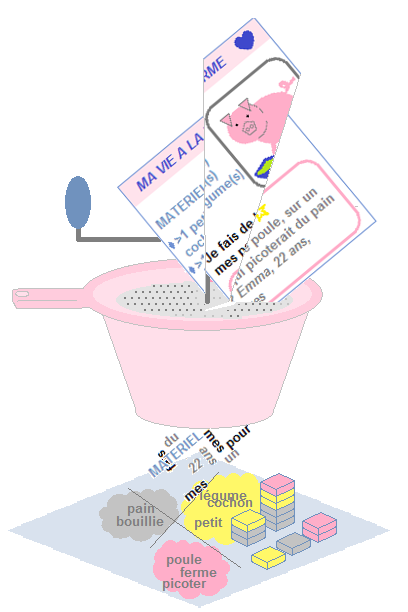

```{r setup, include=FALSE}
library(learnr)
library(gradethis)

Sys.setlocale("LC_ALL", "fr_FR.UTF-8")
gradethis_setup()
 
knitr::opts_chunk$set(echo = FALSE,message=FALSE)
```

```{r}
tib_meta=readr::read_csv2("data/ministereco_tib_meta.csv")
tib_docs=readr::read_csv2("data/ministereco_tib_docs.csv")
```

## 0) Introduction 

{width=70px}<a href="http://perso.ens-lyon.fr/lise.vaudor/Descriptoire/_book/intro.html" target="_blank">Cliquer ici pour les diapos de cours</a>

Ce document rassemble un certain nombre d'exercices, qui sont de **deux types**.

- Des exercices de type **QCM**.
- Des exercices de type **code**.

### 0_1) Exercices de code

Dans ce deuxième type d'exercice, vous pourrez **modifier du code** dans une fenêtre (fond jaune pâle) qui est l'équivalent d'un **éditeur** (très simplifié) de code R. Pour **exécuter** les lignes de code, vous pouvez vous placer dessus et faire **Ctrl+Enter**. Le résultat s'affichera dans une fenêtre (fond rose pâle) en-dessous qui est l'équivalent d'une **console** R.

```{r decouvre_exos, exercise=TRUE}
a=33
b=29
a=___
a
```

```{r decouvre_exos-solution}
a=33
b=29
a=22
a
```

```{r decouvre_exos-check}
grade_result(pass_if(~identical(a,22),
                     "Très bien! Le résultat du code correspond bien à la valeur 22"),
             fail_if(~!identical(a,22),
                     "Ah non! le résultat du code ne correspond pas à la valeur attendue..."))
```

Le code que vous entrerez peut être évalué automatiquement lorsque vous appuyez sur **Submit solution**. 

L'évaluation porte usuellement sur la dernière commande écrite dans l'éditeur (celle écrite tout en bas!), ainsi que (plus généralement) sur le fait que le code ne génère pas d'erreur lors de son exécution.

Par exemple, l'exercice ci-dessus est paramétré pour être évalué comme correct quand la dernière commande (donc d'après le code pré-renseigné l'objet `a`) correspond à la valeur 22, et incorrect autrement... Vous pouvez corriger (ou non) le code dans l'éditeur pour tester le comportement de l'évaluation...

### 0_2) Exercices type "QCM"

```{r usages_R}
question("Que pouvez-vous faire avec R?",
    answer("Des modèles", correct=TRUE),
    answer("Des simulations", correct=TRUE),
    answer("Des statistiques", correct=TRUE),
    answer("Du café"),
    answer("Des graphiques", correct=TRUE),
    answer("Des rapports", correct = TRUE),
    answer("Des pains au chocolat"),
    answer("Des diaporamas", correct=TRUE),
    incorrect="Seules deux de ces propositions ne sont pas correctes",
    correct="Oui! C'est dommage pour le café mais il faut bien une motivation pour se lever de son fauteuil de temps en temps...",
    allow_retry=TRUE
)
```

## 1) Lecture d'un texte et constitution d'un corpus

```{r part1-setup, echo=FALSE}
library(tidyverse)
tib_meta=read_csv2("data/ministereco_tib_meta.csv")
tib_meta_N5=tib_meta[1:5,]
```

(Séance 1)

### 1_1 Lecture d'un texte

Votre répertoire de travail comprend :

- un dossier `data` qui comprend lui-même
  + un sous-dossier `textes` qui comprend lui-même
    + un certain nombre de textes dont un qui s'appelle 
    "Lutte contre la précarité des femmes : Élisabeth Moreno et Emmanuelle Wargon se rendront à la Cité des dames (Paris-13) ce vendredi 14 janvier 2022 .txt"
    
**Complétez le code** pour **lire le texte contenu dans ce fichier**. Le résultat en question sera assigné à un objet appelé `texte`.    
*Le package `tidyverse` a déjà été chargé dans l'environnement ci-dessous.*

```{r exo1_1, exercise=TRUE, exercise.lines=8, exercise.setup="part1-setup"}
titre="Lutte contre la précarité des femmes : Élisabeth Moreno et Emmanuelle Wargon se rendront à la Cité des dames (Paris-13) ce vendredi 14 janvier 2022 "
texte=read_file(___=paste0("data/textes/",___,".txt"))
print(texte)
```

```{r exo1_1-solution}
titre="Lutte contre la précarité des femmes : Élisabeth Moreno et Emmanuelle Wargon se rendront à la Cité des dames (Paris-13) ce vendredi 14 janvier 2022 "
texte=read_file(file=paste0("data/textes/",titre,".txt"))
print(texte)
```

```{r exo1_1-check}
grade_this({
  titre="Lutte contre la précarité des femmes : Élisabeth Moreno et Emmanuelle Wargon se rendront à la Cité des dames (Paris-13) ce vendredi 14 janvier 2022 "
  texte=readr::read_file(file=paste0("data/textes/",titre,".txt"))
  if(!"texte" %in% ls(envir=.envir_result)){
    fail("L'objet `texte` n'a pas été créé.")
  }
  if(!identical(.envir_result[["texte"]],texte)){
    fail("Votre texte ne correspond pas au texte attendu.")
  }
  pass("Très bien! Vous savez lire un texte brut depuis un fichier .txt.")
})
```

### 1_2) Lecture de plusieurs textes

#### 1_2_a) Définition d'une fonction

Examinez cette fonction :

```{r,eval=FALSE, echo=TRUE}
lit_texte <- function(titre,dossier="data/textes/"){
  texte=readr::read_file(file=paste0(dossier,
                              titre,
                              ".txt"))
  return(texte)
}
```


```{r exo_1_2_a}
question("A quoi sert cette fonction?",
    answer("Elle prend un titre de document en entrée et renvoie le texte qu'il contient en sortie", correct=TRUE),
    answer("Elle prend un titre de document en entrée et renvoie le chemin vers ce document en sortie"),
    answer("Elle prend le chemin du document en entrée et renvoie le texte qu'il contient en sortie"),
    correct="Oui! Vous pouvez aussi, si besoin, modifier le nom du dossier qui contient les fichiers grâce à l'argument `dossier`.",
    incorrect="Non! Vous pouvez examiner le code de l'exercice précédent pour mieux comprendre ce que réalise cette fonction.",
    allow_retry=TRUE
)
```

#### 1_2_b) Execution en boucle avec `map()**

**Exécutez la fonction `lit_texte()` de manière itérative sur plusieurs textes**, à partir de la liste des titres, `titres`, et à l'aide de la fonction `map_chr()` du package `purrr`.

*Le package `tidyverse` et la table `tib_meta_N5` ont déjà été chargés dans l'environnement ci-dessous.*

`tib_meta_N5` est un extrait (de taille 5) de la table des métadonnées. La voici:

```{r show_tib_meta_N5}
tib_meta_N5
```


```{r exo1_2_b, exercise=TRUE, exercise.lines=8, exercise.setup="part1-setup"}
lit_texte <- function(titre,dossier="data/textes/"){
  texte=read_file(file=paste0(dossier,
                              titre,
                              ".txt"))
  return(texte)
}

titres=tib_meta_N5$titre

textes=map_chr(.x=___,.f=___)
```

```{r exo1_2_b-solution}
lit_texte <- function(titre,dossier="data/textes/"){
  texte=read_file(file=paste0(dossier,
                              titre,
                              ".txt"))
  return(texte)
}

titres=tib_meta_N5$titre

textes=map_chr(.x=titres,.f=lit_texte)
```

```{r exo1_2_b-check}
grade_this({
  titres=tib_meta_N5$titre
  lit_texte <- function(titre,dossier="data/textes/"){
  texte=read_file(file=paste0(dossier,
                              titre,
                              ".txt"))
  return(texte)
  }
  textes=map_chr(.x=titres,.f=lit_texte)

  if(!"textes" %in% ls(envir=.envir_result)){
    fail("L'objet `textes` n'a pas été créé.")
  }
  if(!identical(.envir_result[["textes"]],textes)){
    fail("Vos textes ne correspondent pas aux textes attendu.")
  }
  pass("Impec! Vous savez exécuter une fonction en boucle pour lire plusieurs fichiers!")
})
```

### 1_3) Métadonnées

#### 1_3_a) Travailler sur les métadonnées

*Le package `tidyverse` et la table `tib_meta` ont déjà été chargés dans l'environnement ci-dessous.*

La table des métadonnées `tib_meta` comprend un certain nombre de descripteurs des textes, notamment la **date de publication** (`date`) et le **nom du ministre** (`ministre`) en exercice à ce moment.

Utilisez les fonctions de `dplyr` pour **compter, par ministre, le nombre moyen de communiqués par jour**.


```{r exo1_3_a, exercise=TRUE, exercise.lines=8, exercise.setup="part1-setup"}
tib_meta %>% 
  group_by(___) %>% 
  summarise(ndocs=___,
            datemax=max(date),
            datemin=min(date),
            duree=datemax-datemin) %>% 
  mutate(ndocsparjour=___/as.numeric(___))
```

```{r exo1_3_a-solution}
tib_meta %>% 
  group_by(ministre) %>% 
  summarise(ndocs=n(),
            datemax=max(date),
            datemin=min(date),
            duree=datemax-datemin) %>% 
  mutate(ndocsparjour=ndocs/as.numeric(duree))
```

```{r exo1_3_a-check}
grade_this({
  if(!stringr::str_detect(.user_code,"ministre")){
    fail("Vous n'avez pas utilisé la variable ministre")
  }
  if(!stringr::str_detect(.user_code,"ndocs=n")){
    fail("Vous n'avez pas utilisé la fonction auxiliaire n()")
  }
  pass_if_equal(message="Très bien!")
  fail(hint=TRUE)
})
```

#### 1_3_b) Réunir métadonnées et textes dans une table

Nous allons maintenant **modifier la table des métadonnées pour y ajouter une nouvelle colonne qui comprendra les textes eux-mêmes**. Nous allons pour ce faire réutiliser les fonctions 
- `lit_texte()` (définie auparavant) 
- `map()` (pour itérer sur 5 textes) 

En effet, pour ne pas surcharger le serveur et réaliser cette opération rapidement nous allons effectuer ce calcul **pour une sous-partie du tableau correspondant aux 5 premières lignes** de `tib_meta` (`tib_meta_N5`).

*Le package `tidyverse` et la table `tib_meta_N5` ont déjà été chargés dans l'environnement ci-dessous.*

```{r exo1_3_b, exercise=TRUE, exercise.lines=8, exercise.setup="part1-setup"}
lit_texte <- function(titre,dossier="data/textes/"){
  texte=readr::read_file(file=paste0(dossier,
                              titre,
                              ".txt"))
  return(texte)
}

tib_docs_N5 <- tib_meta_N5 %>% 
  mutate(texte=___(.x=titre, .f=___))
tib_docs_N5
```

```{r exo1_3_b-solution}
lit_texte <- function(titre,dossier="data/textes/"){
  texte=readr::read_file(file=paste0(dossier,
                              titre,
                              ".txt"))
  return(texte)
}

tib_docs_N5 <- tib_meta_N5 %>% 
  mutate(texte=map_chr(.x=titre, .f=lit_texte))
tib_docs_N5
```

```{r exo1_3_b-check}
grade_this({
  cond1=!stringr::str_detect(.user_code,"map_chr\\(")
  cond2=stringr::str_detect(.user_code,"map\\(")
  if(cond1&cond2){
    fail("Vous devriez chercher la variante de la fonction map qui sert à mettre en forme les résultats sous forme de vecteur de type caractère...")
  }
  if(!stringr::str_detect(.user_code,"lit_texte")){
    fail("Vous n'avez pas fait référence à la fonction lit_texte")
  }
  pass_if_equal(message="Parfait! Savoir utiliser les fonctions du package purrr est une compétence précieuse. Elle peut vous permettre d'automatiser bien des traitements.")
  fail(hint = TRUE)
})
```


## 2) Nettoyage du corpus

(Séance 1)

```{r part2-setup}
library(tidyverse)
tib_meta=readr::read_csv2("data/ministereco_tib_meta.csv")
tib_docs=readr::read_csv2("data/ministereco_tib_docs.csv")
tib_meta_N5=tib_meta[1:5,]
tib_docs_N5=tib_docs[1:5,]
```

### 2_1) Recherches, filtres et nettoyages via l'usage de stringr

*Le package `tidyverse` et la table `tib_meta_N5` ont déjà été chargés dans l'environnement ci-dessous.*

#### 2_1_a) Recherche des ’

Il y a dans ce corpus des apostrophes correspondant à divers encodages et/ou types de caractère (parfois `'`, parfois `’`). Dans le texte suivant remplacez automatiquement toutes les apostrophes `’` (penchées) par des apostrophes `'` (droites).

*Le package `tidyverse` et la table `tib_docs_N5` ont déjà été chargés dans l'environnement ci-dessous.*

```{r exo2_1_a, exercise=TRUE, exercise.lines=8, exercise.setup="part2-setup"}
texte="l’approvisionnement gazier de l’Europe"
___(texte,"’",___)
```

```{r exo2_1_a-solution}
texte="l’approvisionnement gazier de l’Europe"
str_replace_all(texte,"’","'")
```

```{r exo2_1_a-check}
grade_this({
  cond1=!stringr::str_detect(.user_code,"str_replace_all\\(")
  cond2=stringr::str_detect(.user_code,"str_replace\\(")
  if(cond1&cond2){
    fail("Attention à bien remplacer TOUTES les occurences de l'apostrophe ’ et non juste la première...")
  }
  # or fallback to a failing grade
  pass_if_equal(message="Parfait. Ici l'usage conjoint des fonctions de stringr et dplyr permet de nettoyer les textes sans les 'sortir' de la table.")
  fail(hint = TRUE)
})
```

#### 2_1_b) Intégration d'espaces à la suite des apostrophes en vue de la tokenisation

La fonction de **tokenisation** `unnest_tokens` a été conçue par des anglophones...  qui ne gèrent pas correctement certains éléments de texte comme d', l', s', qui ne sont pas séparés des mots qu'ils précèdent par un espace. Ces éléments se retrouvent donc accolés aux mots qui les suivent **comme s'il n'en constituaient qu'un** (on se retrouve alors avec des tokens comme par exemple "d'avoir", "l'arrivée", "s'est", etc.). 

**Intégrez des espaces à la suite des apostrophes** dans l'ensemble des textes pour que la tokenisation se fasse de manière adéquate.

*Le package `tidyverse` et la table `tib_docs_N5` ont déjà été chargés dans l'environnement ci-dessous. On continue selon la même logique que l'exercice précédent, sauf que cette fois on intègre les modifications directement à la table.*

```{r exo2_1_b, exercise=TRUE, exercise.lines=8, exercise.setup="part2-setup"}
tib_textes_N5 <- tib_docs_N5 %>% 
  mutate(texte=str_replace_all(texte,"’","'")) %>% 
  mutate(_________)
```

```{r exo2_1_b-solution}
tib_textes_N5 <- tib_docs_N5 %>% 
  mutate(texte=str_replace_all(texte,"’","'")) %>% 
  mutate(texte=str_replace_all(texte,"'","' "))
```

```{r exo2_1_b-check}
grade_this({
  cond1=!stringr::str_detect(.user_code,"str_replace_all\\(")
  cond2=stringr::str_detect(.user_code,"str_replace\\(")
  if(cond1&cond2){
    fail("Attention à bien remplacer TOUTES les occurences de l'apostrophe ’ et non juste la première...")
  }
  if(!stringr::str_detect(.user_code,"mutate")){
    fail("Vous voulez modifier la variable `texte`. Quelle fonction de `dplyr` devez vous utiliser pour cela?")
  }

  pass_if_equal(message="Très bien. Les fonctions de stringr vous seront très utiles pour nettoyer vos corpus de textes...")
  fail(hint = TRUE)
})
```


### 2_2) Spécifier des patterns via l'usage d'expressions régulières

Pour les exercices de la partie 2_2, les packages `dplyr` et `stringr` ont déjà été chargés dans l'environnement, ainsi que l'objet `echant_articles`.

#### 2_2_a) Recherche des majuscules

On recherche toutes les majuscules dans le texte.

*Le package `tidyverse` a déjà été chargé dans l'environnement ci-dessous.*

```{r exo2_2_a, exercise=TRUE, exercise.lines=8, exercise.setup="part2-setup"}
texte="Et c'est ainsi que Georges Pig retrouva Monsieur Dinosaure"

str_extract_all(texte,"_______")
```

```{r exo2_2_a-solution}
texte="Et c'est ainsi que Georges Pig retrouva Monsieur Dinosaure."

str_extract_all(texte,"[:upper:]")
```

```{r exo2_2_a-check}
grade_this({
  cond1=!stringr::str_detect(.user_code,"[:upper:]")
  cond2=!stringr::str_detect(.user_code,"[A-Z]")
  if(cond1|cond2){
    fail("Comment désigner la classe de caractères correspondant aux majuscules?")
  }
  pass_if_equal(message="Très bien. Complexifions un peu notre recherche maintenant...")
  fail(hint = TRUE)
})
```

#### 2_2_b) Recherche de patterns plus complexes.


Examinez le code suivant:


```{r question_2_2_b_a_showcode, echo=TRUE}
texte="Boum. Et c'est ainsi que Georges Pig retrouva Monsieur Dinosaure."

resultat=str_extract_all(texte,"[:upper:][:lower:]*")
```


```{r question_2_2_b_a}
question("Que va vous renvoyer cette dernière ligne de code?",
    answer("Boum, Et, Georges, Pig, Monsieur, Dinosaure", correct=TRUE),
    answer("Bo,Et,Ge,Pi,Mo,Di"),
    answer("Rien"),
    answer("L'ensemble du texte inchangé."),
    incorrect="On cherche: une lettre majuscule, suivie d'un nombre variable de lettres minuscules.",
    correct="Oui! On a récupéré tous les mots en majuscules.",
    allow_retry=TRUE
)
```

Examinez le code suivant:


```{r question_2_2_b_b_showcode, echo=TRUE}
texte="Boum. Et c'est ainsi que Georges Pig retrouva Monsieur Dinosaure."

resultat=str_extract_all(texte,"(?<=[^[:punct:]]\\s)[:upper:][:lower:]*")
```


```{r question_2_2_b_b}
question("Que va vous renvoyer cette dernière ligne de code?",
    answer("Boum, Et, Georges, Pig, Monsieur, Dinosaure"),
    answer("Georges, Pig, Monsieur, Dinosaure", correct=TRUE),
    answer("Boum, Et, Georges, Pig, Monsieur"),
    incorrect="On cherche: un mot commençant par une majuscule, qui n'est PAS précédé par un signe de ponctuation mais est précédé par un espace.",
    correct="Oui! Cette expression régulière va nous renvoyer tous les mots avec une majuscule sauf 'Boum' qui n'est pas précédé d'un point et 'Et' qui arrive après un point et un espace.",
    allow_retry=TRUE
)
```


#### 2_2_c) Application à l'ensemble des textes

On cherche à détecter les sigles dans les textes, en considérant qu'ils correspondent vraisemblablement à un **enchaînement de plusieurs majuscules (au moins 2)**.

```{r exo2_2_c, exercise=TRUE, exercise.lines=8, exercise.setup="part2-setup"}
extrait_sigles <- function(texte){
  pattern=_____________
  sigles <- str_extract_all(texte,pattern)
  return(sigles)
}
___(.x=tib_docs_N5$texte,
    .f=______)

```

```{r exo2_2_c-solution}
extrait_sigles <- function(texte){
  pattern="[:upper:][:upper:]+"
  sigles <- str_extract_all(texte,pattern)
  return(sigles)
}
map(.x=tib_docs_N5$texte,
    .f=extrait_sigles)
```

```{r exo2_2_c-check}
grade_this({
  pass_if_equal(message="Eh oui... Il y a plusieurs manières de faire mais il faut utiliser les 'quantifiers' des expressions régulières pour gérer le nombre inconnu de majuscules")
  fail(hint = TRUE)
})
```


## 3) Tokenisation et lemmatisation

(Séance 2)


```{r part3_1-setup}
library(tidyverse)
library(tidytext)
tib_textes=readr::read_csv2("data/ministereco_tib_textes.csv")
tib_textes_N5=tib_textes[1:5,]
```

Nous allons maintenant réaliser un certain nombre d'opérations sur une table (réduite) comprenant 5 communiqués de presse: `tib_textes_N5`.

Voici la table en question:

```{r show_tib_textes_N5}
tib_textes_N5
```

Pour les exercices de la partie 3, le `tidyverse` et le package `tidytext` ont déjà été chargés dans l'environnement, ainsi que l'objet `tib_textes_N5`.


### 3_1) Tokénisation

Procédez à la tokenisation des textes (un token = un mot). 
```{r exo3_1, exercise=TRUE, exercise.lines=8, exercise.setup="part3_1-setup"}
tib_mots_N5 <- _____________(tib_textes_N5,
                             output="mot",
                             input=____)
head(tib_mots_N5)
```

```{r exo3_1-solution}
tib_mots_N5 <- unnest_tokens(tib_textes_N5,
                             output="mot",
                             input="texte")

head(tib_mots_N5)
```

```{r exo3_1-check}
grade_this({
  if(!stringr::str_detect(.user_code,"texte")){
    fail("La colonne a prendre en input pour la fonction de tokenisation est la colonne texte")
  }
  if(!stringr::str_detect(.user_code,"unnest_tokens")){
    fail("La fonction de tokenisation sappelle unnest_tokens(). Pourquoi n'apparaît-elle pas dans votre code?")
  }
  pass_if_equal(message="Oui. La fonction unnest_tokens() est vraiment primordiale pour faire de la textometrie sous R, mais on ne s'en sert pas 36 fois dans une analyse de corpus... Passons donc à  autre chose!...")
  fail(hint = TRUE)
})

```


### 3_2) Lemmatisation

```{r part3_2-setup}
library(tidyverse)
library(tidytext)
tib_textes=readr::read_csv2("data/ministereco_tib_textes.csv")
tib_textes_N5=tib_textes[1:5,]
tib_mots_N5 <- unnest_tokens(tib_textes_N5,
                             output="word",
                             input="texte")
head(tib_mots_N5)
```

Pour cet exercice, la table `tib_mots_N5` fait déjà partie de l'environnement.

```{r exo3_2, exercise=TRUE, exercise.lines=8, exercise.setup="part3_2-setup"}
library(mixr)
lexfr=get_lexicon("fr")

tib_lemmes_N5=tib_mots_N5 %>% 
  left_join(____, by="____") %>% 
  filter(!is.na(lemma))

head(tib_lemmes_N5)
```

```{r exo3_2-solution}
library(mixr)
lexfr=get_lexicon("fr")

tib_lemmes_N5=tib_mots_N5 %>% 
  left_join(lexfr, by="word") %>% 
  filter(!is.na(lemma))

head(tib_lemmes_N5)
```

```{r exo3_2-check}
grade_this({
  if(!stringr::str_detect(.user_code,"word")){
    fail("La colonne sur laquelle réaliser la jointure est la colonne 'word'")
  }
  pass_if_equal(message="Oui. Cette jointure permet de lemmatiser les formes présentes dans le texte pour récupérer les noms au singulier, les verbes non conjugués, etc.")
  fail(hint = TRUE)
})

```


### 3_3) Retirer les mots-outils

On veut retenir seulement les noms, verbes et adjectifs (identifiés dans la colonne `type` de `lexfr` comme "nom","ver","adj"). Complétez le code ci-dessous pour **filtrer la table des lemmes** et ne retenir que ces types grammaticaux.

Pour cet exercice, la table `tib_mots_N5` fait déjà partie de l'environnement.

```{r exo3_3, exercise=TRUE, exercise.lines=8, exercise.setup="part3_2-setup"}
library(mixr)
lexfr=get_lexicon("fr")

tib_lemmes_N5=tib_mots_N5 %>% 
  left_join(lexfr, by="word") %>% 
  filter(!is.na(lemma)) %>% 
  filter(___ %in% c(___,___,___))

head(tib_lemmes_N5, n=15)
```

```{r exo3_3-solution}
library(mixr)
lexfr=get_lexicon("fr")

tib_lemmes_N5=tib_mots_N5 %>% 
  left_join(lexfr, by="word") %>% 
  filter(!is.na(lemma)) %>% 
  filter(type %in% c("nom","ver","adj"))

head(tib_lemmes_N5, n=15)
```

```{r exo3_3-check}
grade_this({
  if(!stringr::str_detect(.user_code,"type")){
    fail("On veut filtrer la table en prenant en compte la variable 'type', or vous n'y faites pas référence dans votre code...")
  }
  cond1=stringr::str_detect(.user_code,'nom')
  cond2=stringr::str_detect(.user_code,'ver')
  cond3=stringr::str_detect(.user_code,'adj')
  
  if(!(cond1&cond2&cond3)){
    fail("Avez-vous bien conservé les types 'nom','ver','adj'?")
  }
  pass_if_equal(message="Oui. Ce filtre sur les types grammaticaux permet d'écarter un grand nombre de mots-outils.")
  fail(hint = TRUE)
})

```

## 4) Graphiques descriptifs

(Séance 2)

```{r part4_1-setup}
library(dplyr)
tib_lemmes=readr::read_csv2("data/ministereco_tib_lemmes.csv")
```

### 4_1) Comptage des fréquences de lemmes

**Quels sont les lemmes les plus fréquents dans le corpus?** Complétez le code ci-dessous pour répondre à cette question.

*Le package `tidyverse` et la table `tib_lemmes` ont déjà été chargés dans l'environnement ci-dessous.*

```{r exo4_1, exercise=TRUE, exercise.lines=8, exercise.setup="part4_1-setup"}
tib_freq_lemmes <- tib_lemmes %>% 
  group_by(___) %>% 
  summarise(freq=___) %>% 
  arrange(desc(___))

head(tib_freq_lemmes,n=20)
```

```{r exo4_1-solution}
tib_freq_lemmes <- tib_lemmes %>% 
  group_by(lemma) %>% 
  summarise(freq=n()) %>% 
  arrange(desc(freq))

head(tib_freq_lemmes,n=20)
```

```{r exo4_1-check}
grade_this({
  if(!stringr::str_detect(.user_code,"lemma")){
    fail("On veut compter les lemmes or il n'est pas fait mention de la variable 'lemma' dans votre code...")
  }
  if(!stringr::str_detect(.user_code,"n\\(")){
    fail("N'oubliez pas l'usage de la fonction n() pour compter les occurrences par groupe.")
  }
  if(!stringr::str_detect(.user_code,"desc\\(freq\\)")){
    fail("On veut afficher les lemmes du plus fréquent au moins fréquent...")
  }
  pass_if_equal(message="Oui. On retrouve ici le package dplyr qui est assez ubiquiste...")
  fail(hint = TRUE)
})

```

### 4_2) Graphique en barres

On va représenter les **fréquences d'occurrence des lemmes dans le corpus** par un graphique en barre.

```{r part4_2-setup}
library(tidyverse)
tib_lemmes=readr::read_csv2("data/ministereco_tib_lemmes.csv")
tib_freq_lemmes <- tib_lemmes %>% 
  group_by(lemma) %>% 
  summarise(freq=n()) %>% 
  arrange(desc(freq)) 
```


Pour faire les choses progressivement, commençons par un graphique qui n'est certes pas très joli, mais que l'on améliorera par la suite.

Complétez le code ci-dessous pour représenter les **fréquences des lemmes** dans le corpus. On montrera les **fréquences en x** et les **lemmes en y**.

*Le `tidyverse` a déjà été chargé dans l'environnement, de même que la table `tib_freq_lemmes`.*

```{r exo4_2, exercise=TRUE, exercise.lines=8, exercise.setup="part4_2-setup"}
ggplot(tib_freq_lemmes %>% slice(1:20),
       aes(x=___,y=___)) +
  geom_bar(stat=___)
```

```{r exo4_2-solution}
ggplot(tib_freq_lemmes %>% slice(1:20),
       aes(x=freq,y=lemma)) +
  geom_bar(stat="identity")
```

```{r exo4_2-check}
grade_this({
  if(!stringr::str_detect(.user_code,"y.*=.*lemma")){
    fail("On veut représenter les lemmes en y or il n'est pas fait mention de la variable 'lemma' dans votre code...")
  }
  if(!stringr::str_detect(.user_code,"x.*=.*freq")){
    fail("On veut représenter les fréquences d'occurrence en x or il n'est pas fait mention de la variable 'freq' dans votre code...")
  }
  if(!stringr::str_detect(.user_code,"identity")){
    fail("Le comptage a déjà été fait en amont de l'utilisation de `geom_bar()`. Il faut utiliser la fonction `identity` pour fournir `y`")
  }
  pass(message="Oui. Vous avez le graphique de base, que nous allons un peu améliorer")
})

```

### 4_3) Graphique en barres joli

Nous allons maintenant **arranger le graphique** pour qu'il soit **plus joli**! 

On souhaite notamment **ordonner les lemmes non pas par ordre alphabétique mais en fonction de leur fréquences**. Pour cela on utilisera une fonction du package forcats qui s'appelle `fct_reorder()`. Allez chercher l'aide associée à cette fonction pour voir comment l'utiliser!

```{r exo4_3, exercise=TRUE, exercise.lines=8, exercise.setup="part4_2-setup"}
ggplot(tib_freq_lemmes %>% slice(1:20),
       aes(x=___,
           y=fct_reorder(___,___))) +
  geom_bar(stat="identity")+
  xlab("lemme")
```

```{r exo4_3-solution}
ggplot(tib_freq_lemmes %>% slice(1:20),
       aes(x=freq,
           y=fct_reorder(lemma,freq))) +
  geom_bar(stat="identity")+
  xlab("lemme")
```

```{r exo4_3-check}
grade_this({
  if(!stringr::str_detect(.user_code,"y.*=.*lemma")){
    fail("L'axe y devrait correspondre à la colonne `lemma`, or vous n'y faites pas référence...")
  }
  if(!stringr::str_detect(.user_code,"x.*=.*freq")){
    fail("L'axe x devrait correspondre à la colonne `freq`, or vous n'y faites pas référence...")
  }
  pass(message="Ce graphique est un peu plus lisible que le précédent!...")
  fail(hint = TRUE)
})

```


### 4_4) Nuage de mots

Une des réalisations graphiques les plus classiques en terme de représentation de contenu textuel est le **nuage de mots**.

Réalisez le **nuage des 100 lemmes les plus fréquents** dans le corpus:

```{r exo4_4, exercise=TRUE, exercise.lines=8, exercise.setup="part4_2-setup"}
top_100 <- tib_freq_lemmes %>% 
  na.omit() %>% 
  top_n(___,___)

library(ggwordcloud)
ggplot(___, aes(label=___, size=___, color=log10(freq))) +
  geom_text_wordcloud() +
  theme_minimal()+
  scale_color_gradient(low = "red", high = "forestgreen")
```

```{r exo4_4-solution}
top_100 <- tib_freq_lemmes %>% 
  na.omit() %>% 
  top_n(100,freq)

library(ggwordcloud)
ggplot(top_100, aes(label=lemma, size=freq, color=log10(freq))) +
  geom_text_wordcloud() +
  theme_minimal()+
  scale_color_gradient(low = "red", high = "forestgreen")
```

```{r exo4_4-check}
grade_this({
  if(!stringr::str_detect(.user_code,"lemma")){
    fail("Il faut indiquer à quelle colonne correspondent les mots que vous mettez en nuage... Or vous ne faites référence à `lemma` nulle part?...")
  }
  if(!stringr::str_detect(.user_code,"size\\s*=\\s*freq")){
    fail("La taille des mots dans le nuage devrait correspondre à leur fréquence d'occurrence dans le corpus")
  }
  pass(message="Hé oui. On représente la même information que dans le graphique en barres précédent, mais de manière un peu plus 'design'...")
  fail(hint = TRUE)
})
```

## 5) Analyses statistiques

(Séance 3)

```{r part5-setup}
# pour l'instant identique à part2_2-setup
library(tidyverse)
library(tidytext)
tib_lemmes=readr::read_csv2("data/ministereco_tib_lemmes.csv")
tib_docs=readr::read_csv2("data/ministereco_tib_docs.csv") %>%
  mutate(year=as.factor(lubridate::year(date)))
tib_lemmes=left_join(tib_lemmes,tib_docs %>% select(doc,ministre,date,month,year))
```


(Séance 3)

### 5_1) Fréquences par partie

On définit une partition de notre jeu de données en deux périodes, pré et post covid. Examinez le code suivant:

```{r prepost_covid, echo=TRUE}
tib_meta=tib_meta %>% 
  mutate(covid=case_when(date>lubridate::dmy("01-03-20")~"post",
                         date<=lubridate::dmy("01-03-20")~"pre")) %>% 
  mutate(covid=forcats::fct_relevel(covid,c("pre","post")))
tib_lemmes=left_join(tib_lemmes %>% select(-ministre),
                     tib_docs %>% select(-texte,-titre,-lien),
                     by="doc")
```


```{r qcm_date_covid}
question("Quelle date a-t-on utilisé pour définir la limite?",
    answer("le 20 mars 2001"),
    answer("le 3 janvier 2020"),
    answer("le premier mars 2020", correct=TRUE),
    incorrect="Non... vous pouvez consulter l'aide associée à dmy() pour vous aider...",
    correct="Oui! dmy() correspond à une mise en forme de la date du type jour-mois-année",
    allow_retry=TRUE
)
```


### 5_2) Spécificités

```{r part5_1-setup}
library(tidyverse)
library(mixr)
tib_lemmes=readr::read_csv2("data/ministereco_tib_lemmes.csv")
tib_meta=readr::read_csv2("data/ministereco_tib_meta.csv") %>%
  mutate(year=as.factor(lubridate::year(date))) %>% 
  mutate(covid=case_when(date>lubridate::dmy("01-03-20")~"post",
                         date<=lubridate::dmy("01-03-20")~"pre")) %>% 
  mutate(covid=forcats::fct_relevel(covid,c("pre","post")))
tib_lemmes=left_join(tib_lemmes,
                     tib_meta,
                     by="doc")
```

Calculez les **spécificités des lemmes en lien de la partition du corpus par la variable `covid`**. 

*Le `tidyverse` et le package `mixr` ont déjà été chargés dans l'environnement, de même que la table `tib_lemmes` (qui comprend la variable `covid`).*

```{r exo5_2, exercise=TRUE, exercise.lines=8, exercise.setup="part5_1-setup"}
tib_spec=mixr::______(_____,lemma,____) %>% 
  arrange(desc(spec))
head(tib_spec, n=15)
```

```{r exo5_2-solution}
tib_spec=mixr::tidy_specificities(tib_lemmes,lemma,covid) %>% 
  arrange(desc(spec))
head(tib_spec, n=15)
```

```{r exo5_2-check}
```

### 5_3) Barplot des spécificités

On va maintenant **représenter les termes les plus spécifiques de chaque partie du corpus** (pré-covid vs post-covid).

Complétez le code ci-dessous pour produire un graphique comportant **deux facettes** (avant et après covid) et représentant **en x les spécificités** et **en y les 20 lemmes les plus spécifiques** de chaque partie

*Le `tidyverse` et le package `mixr` ont déjà été chargés dans l'environnement, de même que la table `tib_lemmes_covid`.*

```{r exo5_3, exercise=TRUE, exercise.lines=15, exercise.setup="part5_1-setup"}
tib_spec=mixr::tidy_specificities(tib_lemmes,lemma,covid) %>% 
   mutate(covid=forcats::fct_relevel(covid,c("pre","post")))
tibg_spec=tib_spec %>%
  group_by(covid) %>% 
  slice_max(___,n=__)
ggplot(____,
       aes(x=____,y=forcats::fct_reorder(_____,____),fill=covid))+
  geom_bar(stat="identity")+
  __________(rows=vars(____), scales="free")+
  ylab("lemme")
```

```{r exo5_3-solution}
tib_spec=mixr::tidy_specificities(tib_lemmes,lemma,covid) %>% 
   mutate(covid=forcats::fct_relevel(covid,c("pre","post")))
tibg_spec=tib_spec %>%
  group_by(covid) %>% 
  slice_max(spec,n=20)
ggplot(tibg_spec,
       aes(x=spec,y=forcats::fct_reorder(lemma,spec),fill=covid))+
  geom_bar(stat="identity")+
  facet_grid(rows=vars(covid), scales="free")+
  ylab("lemme")
```


### 5_4) Occurrence d'un champ lexical

Examinez le code suivant:

```{r sujet_ferroviaire, echo=TRUE}
tib_ferroviaire=tib_docs %>% 
  mutate(ferroviaire=str_count(texte,"SNCF|train|ferroviaire|cheminot|chemin de fer"))
```


```{r qcm_ferroviaire}
question("Qu'est-ce que la variable `ferroviaire` quantifie?",
    answer("le nombre de documents qui contiennent une mention d'un des termes cités"),
    answer("l'indication pour chacun des documents d'une mention -TRUE ou FALSE- d'un des termes cités"),
    answer("le nombre de mentions pour chacun des documents d'un des termes cités", correct=TRUE),
    answer("le nombre de documents contenant la mention de l'ensemble des termes cités"),
    incorrect="Quel est l'individu (la ligne) dans cette table? et que veut dire `|`?",
    correct="Tout à fait. On raisonne à l'échelle du document, et on recherche la mention de l'un ou l'autre des termes.",
    allow_retry=TRUE
)
```

Voici le genre de sortie graphique que l'on pourrait construire suite à ce genre de recherche:

```{r echo=TRUE}
ggplot(tib_ferroviaire,
       aes(x=date,y=ferroviaire,col=ministre))+
  geom_bar(stat="identity")
```

### 5-5) Structural Topic Modelling

```{r}
library(tidyverse)
library(tidytext)
tib_meta=readr::read_csv2("data/ministereco_tib_lemmes.csv")
topic_model=readRDS("data/ministereco_topic_model.csv")
```


<!-- Attribuons maintenant une thématique à chacun des documents en se basant sur la probabilité `gamma`: -->

<!-- ```{r tib_docs_topics} -->
<!-- tib_gamma_max=tib_gamma %>%  -->
<!--   group_by(document) %>%  -->
<!--   slice_max(n=1,gamma) %>%  -->
<!--   mutate(doc=paste0("doc",document)) %>%  -->
<!--   select(-document) %>%  -->
<!--   mutate(topic=as.factor(topic)) %>%  -->
<!--   ungroup() -->

<!-- tib_docs_thematiques =tib_docs %>%  -->
<!--   left_join(tib_gamma_max, by="doc") %>%  -->
<!--   mutate(month=lubridate::ymd(date)) -->

<!-- head(tib_docs_thematiques) -->
<!-- ``` -->
### 5_6) Analyse factorielle des correspondances

Réalisons l'analyse factorielle des correspondances en partitionnant le corpus en fonction de l'année.

```{r part5_5-setup, echo=TRUE}
# lemmes hautement spécifiques d'une partie ou d'une autre
lemmes_spec=mixr::tidy_specificities(tib_lemmes,lemma,year) %>% 
  arrange(desc(spec)) %>% 
  filter(spec>10) %>%
  pull(lemma) %>%
  unique()
# table avec lemmes hautement spécifiques
tib_hspec=tib_lemmes %>% 
  filter(lemma %in% lemmes_spec)
# table lexicale
tib_lex=table(tib_hspec$lemma,tib_hspec$year)
```


```{r exo5_5, exercise=TRUE, exercise.lines=15, exercise.setup="part5_5-setup"}
library(FactoMineR)
result_CA=CA(tib_lex, graph=FALSE)

library(factoextra)
fviz_screeplot(result_CA, addlabels = TRUE, ylim = c(0, 50))
```

```{r exo5_5-solution}
library(FactoMineR)
result_CA=CA(tib_lex, graph=FALSE)

library(factoextra)
fviz_screeplot(result_CA, addlabels = TRUE, ylim = c(0, 50))
```


```{r setup_CA,echo=FALSE}
library(FactoMineR)
result_CA=CA(tib_lex, graph=FALSE)

library(factoextra)
fviz_screeplot(result_CA, addlabels = TRUE, ylim = c(0, 50))
```

```{r plot_CA,echo=TRUE}
fviz_ca_biplot(result_CA, repel=TRUE)
```

